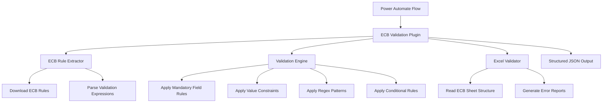

# ECB Validation Plugin for Microsoft Power Platform

## Overview

This C# Dataverse plugin translates the Python Jupyter notebook ECB validation logic into a production-ready Dataverse plugin that can be used within Microsoft Power Platform flows. The plugin dynamically extracts all validation rules from the official ECB Excel file and applies them to user-provided Excel files.

## Key Features

### ✅ **Dynamic Rule Extraction**
- **No Hardcoded Rules**: All 71+ validation rules are extracted directly from the ECB Excel file
- **Pattern Recognition**: Automatically identifies 6 different rule types
- **Robust Parsing**: Handles complex ECB validation expressions

### ✅ **Power Platform Integration**
- **Dataverse Plugin**: Registers as a custom action in Dataverse
- **Power Automate Compatible**: Can be called from Power Automate flows
- **Structured Output**: Returns JSON results for easy processing

### ✅ **ECB File Structure Support**
- **Automatic Column Mapping**: Reads column codes from row 6, starting column D
- **Data Processing**: Extracts data starting from row 8
- **Multi-Sheet Support**: Validates all ECB table sheets (tB_XX.XX format)

## Architecture



## Plugin Components

### 1. **ECBValidationPlugin** (Main Entry Point)
- Implements `IPlugin` interface
- Handles input/output parameters
- Orchestrates the validation process
- Generates structured results for Power Platform

### 2. **ECBRuleExtractor** 
- Downloads ECB Excel file from URL
- Scans worksheets for validation expressions
- Parses expressions into structured rules
- Classifies rule types automatically

### 3. **ECBValidationEngine**
- Applies extracted rules to user data
- Supports multiple validation types:
  - **Mandatory Field Rules**: `not(isnull(...))` patterns
  - **Value Constraint Rules**: `>=`, `<=`, `>`, `<`, `!=` patterns  
  - **Regex Validation Rules**: `match(...)` patterns
  - **Conditional Rules**: `if...then...endif` patterns
  - **Equality Checks**: Simple `=` patterns
  - **Complex Validation**: Multi-condition logic

### 4. **ECBExcelValidator**
- Reads ECB-specific Excel file structure
- Processes multiple table sheets
- Generates detailed error reports
- Aggregates validation results

## Input Parameters

| Parameter | Type | Required | Description |
|-----------|------|----------|-------------|
| `UserExcelFile` | `byte[]` or `string` | ✅ | User Excel file (binary data or base64) |
| `ECBRulesUrl` | `string` | ❌ | Custom ECB rules URL (defaults to official URL) |
| `TableFilter` | `string` | ❌ | Filter for specific tables (e.g., "tB_01") |

## Output Parameters

| Parameter | Type | Description |
|-----------|------|-------------|
| `ValidationResult` | `string` | Complete validation results as JSON |

### Sample Output Structure
```json
{
  "Status": "FAIL",
  "TotalErrors": 15,
  "ProcessedSheets": ["tB_01.02", "tB_02.01"],
  "Report": "# ECB Validation Report\\n...",
  "Timestamp": "2025-01-03T10:30:00Z"
}
```

## Deployment Instructions

### Prerequisites
- **Visual Studio 2022** with .NET Framework 4.7.2+
- **Microsoft.CrmSdk.CoreAssemblies** NuGet package
- **EPPlus** NuGet package for Excel processing
- **System.Text.Json** for JSON serialization

### 1. Build the Plugin
```bash
# Clone the repository
git clone <repository-url>
cd DORAutomation

# Build the solution
dotnet build ECBValidationPlugin.cs -f net472 -c Release
```

### 2. Register the Plugin
1. **Use Plugin Registration Tool**:
   - Download from Microsoft Power Platform Tools
   - Connect to your Dataverse environment
   - Register the assembly (`ECBValidationPlugin.dll`)

2. **Register as Custom Action**:
   - **Name**: `dor_ECBValidation`
   - **Unique Name**: `dor_ECBValidation`
   - **Message**: Create new message
   - **Entity**: None (global action)

3. **Configure Input Parameters**:
   ```
   Name: UserExcelFile, Type: String, Direction: Input
   Name: ECBRulesUrl, Type: String, Direction: Input (Optional)
   Name: TableFilter, Type: String, Direction: Input (Optional)
   ```

4. **Configure Output Parameters**:
   ```
   Name: ValidationResult, Type: String, Direction: Output
   ```

### 3. Configure Security
- Grant **Execute** permissions to appropriate security roles
- Ensure users have access to the custom action
- Configure any additional security requirements

## Usage in Power Automate

### Basic Flow Example
```yaml
1. Trigger: When a file is uploaded to SharePoint
2. Action: Get file content
3. Action: ECB Validation
   - UserExcelFile: [File Content from Step 2]
4. Condition: Check validation result
5a. If PASS: Send success email
5b. If FAIL: Send error report email
```

### Advanced Flow with Error Handling
```yaml
1. Trigger: HTTP request (for API integration)
2. Initialize: Set variables for tracking
3. Try Block:
   - Parse JSON from request body
   - Decode base64 Excel file
   - Call ECB Validation plugin
   - Parse validation results
4. Catch Block:
   - Log error to SharePoint list
   - Send error notification
5. Finally:
   - Return structured response
```

### Power Apps Integration
```javascript
// Call from Power Apps
ClearCollect(
    ValidationResults,
    dor_ECBValidation.Run({
        UserExcelFile: Base64(FileUpload.Image),
        ECBRulesUrl: "custom-url-if-needed"
    })
);

// Process results
If(
    First(ValidationResults).Status = "PASS",
    Navigate(SuccessScreen),
    Navigate(ErrorScreen, ScreenTransition.Fade)
);
```

## Error Handling

### Plugin-Level Errors
- **InvalidPluginExecutionException**: Invalid input parameters
- **HttpRequestException**: ECB file download failures
- **ArgumentException**: Malformed Excel files

### Validation Errors
- **MANDATORY_FIELD_NULL**: Required field is empty
- **VALUE_CONSTRAINT_VIOLATION**: Numeric constraint violated
- **REGEX_PATTERN_MISMATCH**: Pattern validation failed
- **PROCESSING_ERROR**: Sheet processing failed

### Troubleshooting
1. **Plugin Registration Issues**:
   - Verify assembly is signed correctly
   - Check security permissions
   - Validate input/output parameter configuration

2. **Execution Errors**:
   - Check trace logs in Plugin Registration Tool
   - Verify ECB URL accessibility
   - Validate Excel file format

3. **Performance Issues**:
   - Consider caching ECB rules for repeated validations
   - Implement async patterns for large files
   - Monitor plugin execution timeouts

## Maintenance and Updates

### ECB Rule Updates
- Plugin automatically downloads latest ECB rules from official URL
- No code changes required for rule updates
- Consider implementing rule caching for performance

### Version Management
- Tag releases with semantic versioning
- Maintain backward compatibility for Power Platform flows
- Document breaking changes clearly

### Monitoring
- Enable plugin trace logging
- Monitor execution times and success rates
- Set up alerts for validation failures

## Security Considerations

### Data Privacy
- Excel files are processed in memory only
- No persistent storage of user data
- ECB rules cached temporarily during execution

### Access Control
- Plugin respects Dataverse security model
- Use principle of least privilege
- Regular security reviews recommended

### Compliance
- Suitable for regulated environments
- Audit logging available through Dataverse
- Data residency maintained in chosen region

## Performance Metrics

### Expected Performance
- **Rule Extraction**: ~2-3 seconds for 71 rules
- **Validation**: ~1-2 seconds per 1000 rows
- **Memory Usage**: ~50-100MB peak during processing
- **Concurrent Users**: Supports standard Dataverse limits

### Optimization Tips
- Cache ECB rules for repeated validations
- Process sheets in parallel where possible
- Limit error reporting to prevent large outputs
- Consider pagination for very large files

## Support and Documentation

### Additional Resources
- **Power Platform Documentation**: https://docs.microsoft.com/power-platform/
- **Dataverse Plugin Development**: https://docs.microsoft.com/powerapps/developer/data-platform/
- **ECB Reporting Guidelines**: https://eba.europa.eu/

### Community Support
- Power Platform Community Forums
- ECB Validation User Group
- GitHub Issues and Discussions

---

**Note**: This plugin is designed for the specific ECB Excel file structure as of April 2025. Future ECB format changes may require plugin updates.
